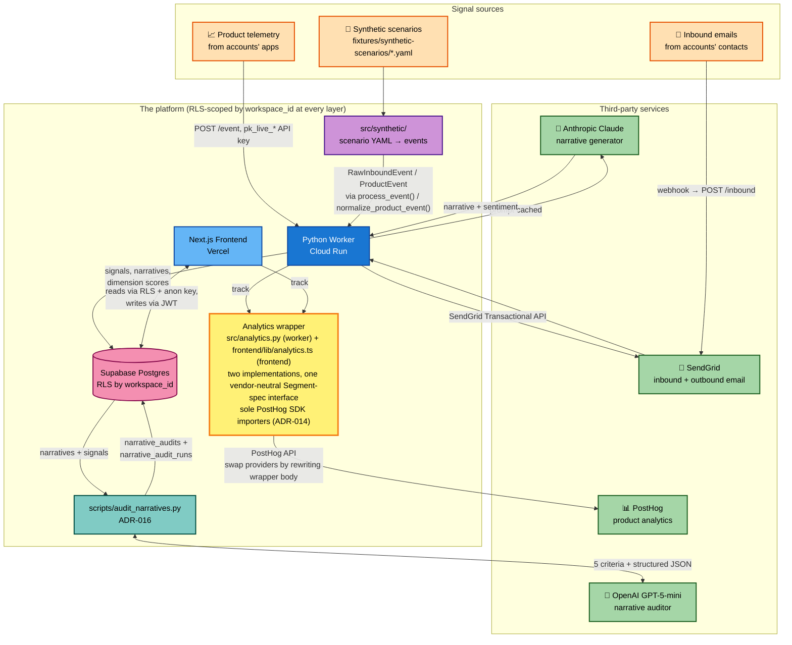
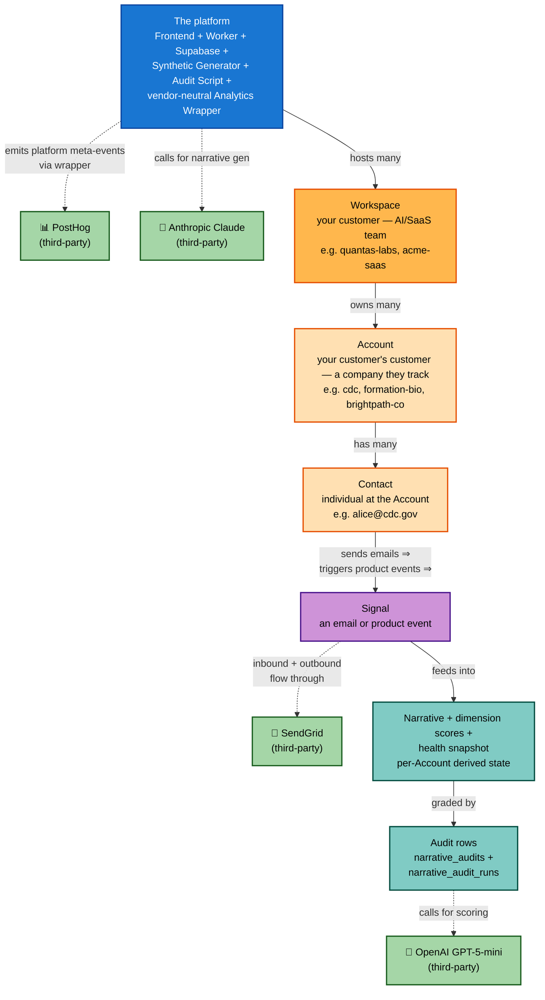
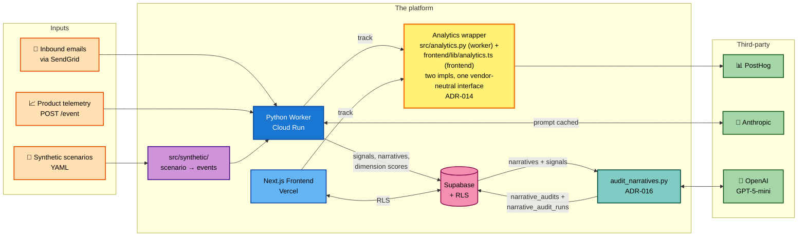

# Architecture

## Overview

The platform processes inbound email as signal, generates account health narratives via Claude, and surfaces account intelligence in a web UI. All signal processing and scoring runs in a Python worker on GCP Cloud Run. The Next.js frontend reads account data directly from Supabase; it calls the worker only for outreach context.

```text
SendGrid Inbound Parse
  │
  │  POST /inbound?token=<WEBHOOK_SECRET>
  ▼
┌─────────────────────────────────────────────────────────────────────┐
│  Python Worker (GCP Cloud Run)                                      │
│                                                                     │
│  Inbound path (per webhook event):                                  │
│    shared_inbox.py   extract workspace slug from envelope           │
│    normalizer.py     upsert contact, insert raw_inbound_event,      │
│                      insert signal                                  │
│    router.py         6-stage routing cascade → account_id           │
│    scheduler.py      enqueue narrative_regen_job                    │
│                                                                     │
│  Narrative path (POST /run-narratives, every 15 min):               │
│    recover_stale_jobs()  promote stuck jobs                         │
│    confidence.py         engagement health score (deterministic)    │
│    generator.py          Claude API call, prompt caching            │
│    health.py             weighted dimension average                 │
│    accounts table        update overall_health_score                │
│                                                                     │
│  Outreach path (POST /outreach/{account_slug}/context):             │
│    JWT → workspace → account → contact                              │
│    outreach.py       recommend template, build signal panel         │
│    get-or-create     draft record in Supabase                       │
└─────────────────────────────────────┬───────────────────────────────┘
                                      │
                                      ▼
                           Supabase (PostgreSQL + RLS)
                                      │
         ┌────────────────────────────┴─────────────────────────┐
         │                                                      │
         ▼  direct read (anon key + RLS)                        ▼  service role (worker only)
┌──────────────────────┐
│  Next.js Frontend    │
│  (Vercel)            │
│                      │
│  /accounts           │  Account list with health badges
│  /accounts/[slug]    │  Narrative, signals, dimensions, outreach
└──────────────────────┘
```

---

## Signal Pipeline

### 1. Inbound Parse

`src/signals/shared_inbox.py` is pure functions with no I/O. It converts SendGrid multipart form fields into the `InboundPayload`-compatible JSON that `normalizer.py` reads from `RawInboundEvent.raw_payload`, and extracts the workspace slug from the envelope `to` field.

Envelope format: `<workspace-slug>@signal.yourdomain.com` or `<workspace-slug>+<account-slug>@signal.yourdomain.com` (optional account hint in the local-part).

### 2. Normalization

`src/pipeline/normalizer.py`:
- Detects outbound BCC (from_email in workspace's internal domains)
- Upserts the sender as a `Contact` (skipped for outbound)
- Inserts a `RawInboundEvent` (immutable audit record)
- Inserts a `Signal` with direction (inbound/outbound), source type, and routing method

### 3. Routing Cascade

`src/pipeline/router.py` is a pure function with no DB calls. Workspace routing (envelope → workspace) happens upstream in [`src/signals/shared_inbox.py:extract_workspace_slug`](../src/signals/shared_inbox.py#L75); the router only handles account routing (signal → `account_id`). Six numbered stages in order; first match wins:

| # | Stage | Matches when | Confidence | RoutingMethod |
|---|---|---|---|---|
| 0 | `outbound_bcc` | `from_email`'s domain is internal AND an external recipient matches an existing account (or is auto-discoverable) | 0.9 / 0.3 | `OUTBOUND_BCC` |
| 1 | `plus_addressing` | a `to`/`cc` address has the shape `<workspace-slug>+<account-slug>@inbound-domain` and the slug resolves | 1.0 | `PLUS_ADDRESSING` |
| 2 | `header_domain` | any non-internal `from`/`to`/`cc` domain matches an existing account's primary or additional domain | 0.9 | `HEADER_DOMAIN` |
| 3 | `forward_parse` | the `from_email` is internal AND the body contains a parseable `From: …` forward-header chain that resolves via stage 2 | 0.7 | `FORWARD_PARSE` |
| 4 | `thread_inherit` | `payload.thread_id` is known and at least one prior signal in the thread had an `account_id` (split-brain picks most-recently-ingested + emits warning) | 0.6 | `THREAD_INHERIT` / `THREAD_INHERIT_SPLIT` |
| 5 | `auto_discovery` | `from_email`'s domain is non-internal, non-personal, and no earlier stage matched → create a candidate account from the domain root | 0.3 | `AUTO_DISCOVERY` |
| — | fall-through | nothing matched | 0.0 | `UNMATCHED` |

Stage 5 creates a candidate (status `CANDIDATE`, requires user Confirm/Reject); the other stages route to existing accounts. See [`docs/signal-routing.md`](signal-routing.md) for the detailed semantics of each stage, the personal-provider blind spot, and how this cascade differs from the product-event flat-rules path.

Unroutable signals (unknown workspace, malformed envelope) return HTTP 200 with `status: permanent_failure` rather than 4xx. SendGrid retries on 4xx indefinitely; permanent failures should not be retried.

### 4. Narrative Scheduler

The narrative regeneration system is a **two-layer queue**: an _enqueue_ layer (writes to `narrative_regen_jobs`) and a _drain_ layer (a 15-minute cron-driven processor). Nothing else triggers `generate_narrative`; the queue is the only path to Claude.

#### Drain layer

Cloud Scheduler fires `POST /run-narratives` every 15 minutes (`*/15 * * * *` UTC). The route ([`src/server/routes/scheduler.py`](../src/server/routes/scheduler.py)):
1. Calls `recover_stale_jobs()` once — promotes any jobs stuck in `RUNNING` state past a timeout threshold (recovers from crashed prior runs).
2. Iterates over all active workspaces.
3. For each workspace, drains up to **20 pending jobs per tick** (`_MAX_JOBS_PER_WORKSPACE`). Job-by-job: mark `RUNNING` → call `generate_narrative(...)` → mark `DONE` or `FAILED`. Jobs against the `_unmatched` account are marked `FAILED` without a Claude call (the unmatched bucket has no semantic account view).

Auth: `Authorization: Bearer <SCHEDULER_SECRET>` header. Unset secret returns 500 (fail closed). Wrong secret returns 401.

#### Enqueue triggers

The `narrative_regen_jobs.triggered_by` column carries one of four values, defined in `RegenTrigger` ([`src/domain/regen_job.py`](../src/domain/regen_job.py)). Two are live in code today; two are reserved enum values defined in the schema CHECK constraint but not yet wired into any call site.

| Trigger | Status | Source |
|---|---|---|
| `new_signal` | Live | After a signal lands + routes to a non-`_unmatched` account. Call sites: [`src/pipeline/run.py`](../src/pipeline/run.py) (inbound email pipeline), [`src/server/routes/signal.py`](../src/server/routes/signal.py) (Plain + Pylon structured signals), [`src/server/routes/event.py`](../src/server/routes/event.py) (product telemetry). Routed via `schedule_regen()` → `enqueue_regen_job()`. |
| `manual` | Live | Frontend "Regenerate" button (`frontend/src/components/NarrativeSection.tsx`) calls `supabase.rpc('enqueue_narrative_regen', { p_account_id })`. The SECURITY DEFINER RPC (migration 000002) enforces workspace ownership, applies the same debounce + rate cap as the Python path, and returns the new job id (or NULL if debounced). |
| `reroute` | Reserved | Defined in enum + schema CHECK; no call site. For a future "signal manually reassigned to a different account" feature. |
| `config_change` | Reserved | Same — defined but unwired. For a future "health-dimension weights changed, rebuild narratives" feature. |

`_unmatched`-routed signals **do not** enqueue (gate in [`src/pipeline/scheduler.py`](../src/pipeline/scheduler.py): if `account_slug == "_unmatched"`, return without enqueueing).

#### Debounce + rate cap

The same logic exists in both the Python `enqueue_regen_job` and the Postgres `enqueue_narrative_regen` RPC. For a given `(workspace_id, account_id)` pair:

1. **Debounce**: If a `pending` job already exists with `scheduled_for > now()`, the new enqueue is a no-op (RPC returns NULL; frontend surfaces "A regeneration is already scheduled"). Prevents enqueue storms when many signals arrive in quick succession.
2. **Rate cap**: If a `DONE` job completed within the last 10 minutes, the new job is scheduled for `last_done + 10 min`. Bounds regen-per-account at roughly 6 / hour.
3. **Default lag**: If neither debounce nor rate cap applies, `scheduled_for = now() + 60 seconds`. Even a fresh signal arrival waits 60s before becoming eligible for the next drain.

#### UX implication for the Regenerate button

A user clicking the in-app Regenerate button can hit any of three states:
- **NULL return (debounce)**: an enqueued job from a prior `new_signal` or earlier click is still pending. UI shows "A regeneration is already scheduled." This is correct behavior, not an error. Browser console may show a 400 from the RPC layer; that's the RPC reporting the NULL return.
- **Rate-cap delay**: the job enqueues with `scheduled_for ~10 min from now()`. Click succeeds; visible refresh takes up to 10 min + cron lag.
- **Default-lag success**: job enqueues with `scheduled_for = now() + 60s`. Visible refresh on the next 15-min cron tick.

Worst-case lag from click to visible refresh: ~15 minutes (drain interval). Best-case: ~60 seconds plus the time to the next tick. There is no fast-path "regenerate immediately" — by design, to keep Claude cost bounded and the operational model simple. A future "interactive immediate regen" feature would need an additional code path — tracked internally, not included in this repo.

#### What does NOT trigger a regen

- Frontend page loads (just render the current narrative)
- Audit harness runs (`scripts/audit_narratives.py` reads narratives; does not generate)
- Signals arriving with routing to `_unmatched`
- Direct calls to `generate_narrative` from scripts or tests (those paths exist but never run in production)

### 5. Narrative Generation

`src/pipeline/generator.py` calls Claude with prompt caching. The prompt is split:
- **System block** (static): output format + guardrails. Eligible for prompt caching.
- **User block** (per-account): account context + recent signals.

The LLM returns structured JSON including `narrative: str` and `sentiment: int` (1-100). Sentiment is extracted here and written as a dimension score after the narrative is persisted.

Post-narrative steps are fire-and-log: a scoring failure never blocks narrative delivery.

---

## Product Telemetry Path

ADR-012 (telemetry ingest) and [ADR-013](adr/adr-013-contact-account-linkage.md) (contact-account linkage on ingest) added a second signal source parallel to inbound email.

### Ingest Endpoint

`POST /event` (renamed from `/ingest` on 2026-05-08 — privacy-aware naming, lower ad-blocker filter-list rate, matches Plausible's `/api/event`) accepts native or Segment payloads (single event or batch up to 500). Authentication is via `Authorization: Bearer pk_live_<16 hex>` — an ingest-scope API key stored in the `api_keys` table, not an environment variable (the API key scope name remains `"ingest"` as an internal auth identifier — endpoint and scope intentionally don't share names, mirroring GitHub's `/repos/...` endpoint with `repo` scope). The worker verifies the key by SHA-256 hash lookup with scope and expiry checks; `last_used_at` is fire-and-log.

Rate limiting: in-memory sliding window per Cloud Run instance, keyed by key prefix. Configurable via `config/defaults.json` `api.ingest_rate_limit_per_minute`.

Body cap: 256KB. Batch cap: 500 events. Response contract: `{accepted, rejected, signal_ids, duplicate_ids, errors}` (partial success — a bad event in a batch does not fail the rest).

### Contact Routing (3-way)

`src/pipeline/product_event.py` routes each event's identity before inserting the signal:

```text
known email    → api_key_identity     (existing contact matched directly)
new email      → auto_discovery       (ADR-013: new contact created, auto-linked to matching account by domain)
missing email  → unmatched            (signal recorded against _unmatched pseudo-account)
```

The auto_discovery path (ADR-013) uses `upsert_contact_safe` — a conflict-safe DB function — to link the new contact to an existing account whose `domain` matches the email domain. This mirrors inbound email's Stage 2 (`header_domain`) routing without going through the email cascade router.

### Embeddable Browser Script

`GET /event.js` serves the embeddable JavaScript snippet built from `src/server/static/event.js` via `npm run build:event-js` at repo root. Customers embed it in their product to forward usage events to the `POST /event` endpoint. (The script is named `event.js` rather than `tracker.js` for the same privacy-aware reason as the endpoint rename — `tracker.js` is on common ad-blocker filter lists.)

---

## Structured Signal Integrations

ADR-020 (multi-source structured signals, phased) added a third category of inbound signal alongside email and product telemetry: structured records pushed or pulled from third-party support and meeting-notes tools. Two ingestion shapes — push and poll — share one normalizer.

### Credential Model

`external_credentials` stores both directions of integration secret:

- **Inbound (push)**: a per-workspace webhook-signing secret for Plain and Pylon ticket events. `kind` is `plain_webhook_secret` or `pylon_webhook_secret`.
- **Outbound (poll)**: a per-workspace Granola API key. `kind` is `granola_api_key`.

Secrets are AES-256-GCM encrypted (`secret_enc`) under `INTEGRATION_ENCRYPTION_KEY`; the `authenticated` role's grant explicitly excludes `secret_enc` (a column-level grant, not just RLS) — only `service_role` (the worker) can ever read it. `integration_state` tracks one poll cursor plus error counters per credential (`UNIQUE (credential_id)`); it exists only for poll-based integrations (Granola today).

### Push Path: Plain + Pylon Tickets

**Endpoint**: `POST /signal/{kind}` ([`src/server/routes/signal.py`](../src/server/routes/signal.py)). Only `kind=ticket` has a registered adapter; any other `kind` — including the reserved `note` — returns 501.

Both Plain and Pylon deliver ticket webhooks to the same URL. Vendor identity is determined by which signature header is present, not by a URL parameter:

| Header present | Vendor | Workspace lookup |
|---|---|---|
| `Plain-Request-Signature` | Plain | `body.workspaceId` → `external_credentials` row |
| `X-Pylon-Signature` | Pylon | `body.data.workspace_id` (or `.workspaceId`) → `external_credentials` row |
| Neither | — | 401 (cannot determine vendor) |

Per-request flow (identical shape for both vendors): read raw body bytes → parse JSON → look up the credential by vendor-specific workspace id → decrypt the signing secret → verify the HMAC signature (Pylon additionally requires a `Pylon-Webhook-Timestamp` header) → parse the vendor payload into a `StructuredSignalInput` → normalize → fire-and-log narrative regen. An unknown workspace ID returns HTTP 200 (`{"status": "workspace_unknown"}`) rather than 4xx — same reasoning as unroutable email returning 200 — to avoid the vendor's retry storm (Pylon retries up to 4 times) against a webhook that will never resolve.

### Pull Path: Granola Meeting Notes

**Endpoint**: `POST /run-polls` ([`src/server/routes/polls.py`](../src/server/routes/polls.py)). Mirrors `/run-narratives` exactly: `Authorization: Bearer <SCHEDULER_SECRET>`, fail-closed 500 if unset, 401 on mismatch, intended to be driven by its own Cloud Scheduler job (`integration-poller`, `*/15 * * * * UTC`) — creating that scheduler job is an ops step, not something the endpoint depends on to exist.

Granola is pull-only; there is no `/signal/note` push adapter for it (that `kind` is reserved but unregistered). `POST /run-polls` fans out over every active workspace's active `granola_api_key` credentials and calls `poll_workspace_granola()` per credential:

- **Cursor discipline**: the stored cursor is namespaced (`granola:<note_id>`) and only advances after a batch of notes is confirmed written to `signals` — a crash between write and cursor-advance re-fetches the same batch on the next poll; dedup on `(workspace_id, external_id)` treats the re-fetch as a no-op rather than a duplicate narrative-regen trigger.
- **Auto-deactivation**: `consecutive_errors >= config.integrations.max_consecutive_errors` (default 5) deactivates the credential (`is_active = false`). At the 15-minute poll cadence, that's roughly 75 minutes of continuous failure before a broken integration stops being retried.
- Recoverable errors (rate limit, 5xx, timeout) leave the cursor untouched and increment the error counter; auth errors (401/403) additionally record a human-readable `error_message` on the credential.

### Shared Normalization

Both paths funnel into [`src/pipeline/structured_signal.py`](../src/pipeline/structured_signal.py)`::normalize_structured_signal`, which mirrors the product-event 3-way contact routing exactly (known email → `API_KEY_IDENTITY`; new email matching an active account's domain → `AUTO_DISCOVERY` with `account_id` set; new email with no domain match → `AUTO_DISCOVERY` with `account_id = NULL`; no participant email → `UNMATCHED`). Like the product-event path, and unlike the email cascade, structured signals never create a `CANDIDATE` account — workspace identity here comes from the credential the event was authenticated against, not from any per-event routing decision.

`signals.source_type` gained `plain_ticket`, `pylon_ticket`, and `granola_note`; `signals.channel` gained `ticket` and `meeting_note`; a new `signal_metadata` JSONB column carries vendor-specific fields the typed columns don't cover (migration 000029, extended by 000030 for Pylon).

---

## Health Scoring

### Dimensions

Four dimensions, each scored 1-100:

| Dimension | Type | Scored by | Weight |
|---|---|---|---|
| Email Engagement | `email` | System (deterministic) | 35% |
| Product Usage | `product_usage` | System (deterministic) | 35% |
| Sentiment | `sentiment` | LLM (extracted from narrative) | 20% |
| CSM Score | `csm_score` | Human (manual input) | 10% |

Weights are configurable per workspace via `config/workspaces/<slug>.json` overrides on `config/defaults.json`. `product_usage` was activated at its current weight in migration 000022 (ADR-017); migration 000023 is an ADR-017 amendment adding the cascading window described below.

### Email Engagement (Deterministic)

`src/pipeline/confidence.py` is a pure function. Score is a function of:
- Signal count in the recency window
- Window length (configurable per workspace)
- Contact diversity (signals from multiple contacts score higher)
- `account.frequency_multiplier` (per-account scaling for accounts with inherently high or low email volume)

The LLM never decides engagement health. No model call is made in this path.

### Product Usage (Deterministic)

Scored from `POST /event` product-telemetry signals (see [Product Telemetry Path](#product-telemetry-path) above), on the same deterministic footing as Email Engagement — no model call. Config (`config/defaults.json` → `health_scoring.dimensions[dimension_type=product_usage].config`):

- `window_days` (7) — primary recency window
- `window_days_cascade` (`[7, 14, 30, 60]`, migration 000023 / ADR-017 amendment) — when the primary window has too few events to score confidently, the cascade widens the window stepwise rather than reporting "no data" for an account that's simply used the product less recently than the default window assumes
- `min_events_for_active` (1) — minimum event count within a window to count the account as active at all
- `trajectory_decay_ratio` (0.5) — weights more recent activity more heavily than older activity within the window

### Sentiment

Extracted from `narrative.sentiment` after generation. Written as a `DimensionScore` row with `scored_by = 'llm'`. If `narrative.sentiment` is `None` (LLM returned null), the dimension score is skipped for that run and a warning is logged.

### CSM Score

Set manually via the frontend's "Update CSM Score" form. Calls the `set_csm_score` Supabase RPC, which inserts a `DimensionScore` row with `scored_by = 'csm'` and recomputes `overall_health_score`.

### Overall Health

`src/pipeline/health.py` is a pure function. Computes a weighted average of the most recent active score for each enabled dimension. Returns `None` if no scores exist or if sum-of-weights is zero. `accounts.overall_health_score` is a denormalized cache, updated synchronously after each scoring event.

### Append-Only Scoring Tables

`account_dimension_scores` and `account_health_snapshots` use a supersede pattern: a new row is inserted for each scoring event; the prior active row is marked `superseded_at = now()`. This preserves full scoring history while keeping point-in-time queries simple (filter `superseded_at IS NULL`).

---

## Outreach Templates

Replaced LLM draft generation ([ADR-010](adr/adr-010-outreach-templates.md)) after hallucination risk was identified as structural rather than a prompt engineering problem. No AI-generated text reaches the send path.

### Template System

Six markdown templates in `config/templates/outreach/`, each with YAML frontmatter:

```text
check_in.casual.md         Default check-in; healthy or neutral accounts
check_in.reengagement.md   Re-engagement; low engagement or long silence
expansion.usecase.md       Expansion; new use case, not seat growth
renewal.relationship.md    Renewal; strong relationship, proactive
renewal.risk.md            Renewal; risk signals present
custom.blank.md            Blank template for bespoke messages
```

Frontmatter fields: `id`, `intent`, `label`, `description`. Body uses `[placeholder]` slots for required fill-ins.

### Template Recommendation

`outreach.py` `recommend_template` is a pure function with 5 deterministic rules applied in priority order:
1. Renewal intent flagged on account → `renewal.risk` or `renewal.relationship` based on health score
2. Health score below risk threshold → `check_in.reengagement`
3. Long silence (no signals in N days) → `check_in.reengagement`
4. Expansion signals detected → `expansion.usecase`
5. Default → `check_in.casual`

### POST /outreach/{account_slug}/context Flow

```text
POST /outreach/{account_slug}/context (JWT auth)
  JWT → user_id → workspace_id (via users table)
  account lookup by slug
  contact lookup (primary contact for account)
  recommend_template() → (template_id, rationale)
  load_all_templates() → template list
  get_active_draft() or create new draft with recommended template pre-seeded
  get signals for account (recent, capped at max_signals_in_context)
  → JSON: account, contact, templates, recommended_template_id, draft, signals
```

The frontend renders a template picker (intent tabs + radio buttons), a recommendation banner, and a signal panel. The send button is blocked until all `[...]` slots in the subject and body are filled.

---

## Synthetic Data + Cross-Vendor Audit

ADR-015 (synthetic data generator contract) and ADR-016 (cross-model audit harness) extend the test substrate beyond the 63 hand-authored Quantas Labs account fixtures that originally anchored the pipeline's regression tests. Those fixtures are pilot-derived and live in `.private/`, not in this tracked tree — see the Test Layer section below for how the equivalence test degrades gracefully in their absence. Synthetic generation is additive on top of them.

### Synthetic Data Generator (ADR-015)

Four-layer architecture, strict directional dependencies:

```text
Scenario YAML (fixtures/synthetic-scenarios/*.yaml)
  │  Pydantic validation (extra="forbid")
  ▼
Per-modality generators (src/synthetic/generators/)
  email.py    — 5 language registers × 7 topical families × 6 templates each = 210 templates
  product.py  — product-event payload synthesis
  │  Pure functions: seeded random.Random, no datetime.now(), deterministic uuid5 IDs
  ▼
Conversion + emission (src/synthetic/orchestrator.py)
  RawInboundEvent (email)  → process_event()           [src/pipeline/run.py]
  ProductEvent              → normalize_product_event() [src/pipeline/product_event.py]
  │  Never bypass production normalisation — pipeline correctness is what's under test
  ▼
Materialise to disk (uv run python -m src.worker synthesise-fixtures)
  fixtures/synthetic/<scenario>/
    manifest.json     — deterministic state, byte-identical across runs
    last_run.json     — wall-clock generated_at (gitignored from byte-identity tests)
    workspace.json + accounts/ + signals/<account-slug>/NNN.json
```

Scenarios are defined by an `AxesSpec` with 9 axes:

- 8 structural: `contact_diversity`, `domain_mixing`, `message_length`, `response_cadence`, `language_register`, `threading_topology`, `sentiment_trajectory`, `cross_modal`
- 1 topical: `concern_topic` (Rev 1) — 8 values: `none | pricing | outage | feature_gap | utilization_decline | competitive | success_expansion | renewal_pending`. Drives template-family selection.

The audit corpus today comprises 11 narratives spanning 7 of 8 topic values (only `pricing` not yet exercised by a corpus scenario): 5 Phase 2a-b scenarios + 1 `expanding-champion` scenario — all 6 tracked in `fixtures/synthetic-scenarios/` — plus 5 from a `quantas-labs-baseline.yaml` scenario that regenerates the 63 hand-authored Quantas Labs fixtures via an `expected_routing` equivalence assertion. That baseline scenario and its underlying fixtures are pilot-derived and kept in `.private/`; they are not part of the public/tracked scenario set, so a contributor working from this repo can reproduce 6 of the 11 corpus narratives directly, not all 11.

### Audit Harness (ADR-016)

`scripts/audit_narratives.py` grades production-generated narratives on 5 criteria using OpenAI `gpt-5-mini-2025-08-07` (pinned snapshot — cross-vendor for training-priors independence vs same-vendor Claude Haiku):

| # | Criterion | Measure | Gate |
|---|---|---|---|
| C1 | Faithfulness (claims supported by signals) | 1-5 score, ≤2 fails | Hard |
| C2 | Coverage (touches enabled dimensions) | Pass/fail | Hard |
| C3 | Calibration (sentiment language matches numeric score) | 1-5, ≤2 fails | Hard |
| C4 | Hallucination (no invented contacts/dates/events) | Pass/fail | Hard |
| C5 | Tone fit (matches workspace voice) | Pass/fail | Warning only |

C1 and C4 are deliberately separate: C1 catches unsupported claims (quality issue), C4 catches invented specifics (trust/data integrity issue).

```text
Audit invocation
  ├── narrative + source signals + dimension config + system prompt
  ▼
OpenAI GPT-5-mini structured-output call
  max_completion_tokens: 16000  (NOT max_tokens — GPT-5 family rejects)
  reasoning_effort: "low"        (low budget for reasoning tokens)
  response_format: json_schema   (strict mode, no additionalProperties)
  ▼
Parse 5-criterion structured response
  ▼
narrative_audits      ← 5 rows (one per criterion)
narrative_audit_runs  ← 1 aggregate row (overall_passed, hard_gate_failures,
                        warning_failures, score_summary, summed cost)
  Both committed atomically via compensating delete on aggregate-row failure
```

**Triggers** (per ADR-016 D5):
- Per-PR (`audit_source='ci'`, gates merge): GitHub Actions workflow at `.github/workflows/audit-narratives.yml`, `environment: production` requires maintainer approval before secret injection (defense against compromised-collaborator key exfil).
- Nightly cron (`'nightly'`, trend tracking): same workflow, scheduled trigger.
- Manual CLI (`'manual'`, ad-hoc): `uv run python scripts/audit_narratives.py --audit-source manual --write-db`. Used locally against dev Supabase.

**Gating**: any single hard-gate failure on any narrative blocks the PR. Strict, no aggregation. Cost ~$0.055/run for the 11-narrative corpus; `AUDIT_MAX_COST_USD` env var caps it at $0.50 by default.

**`audit_run_id` format** (D11): `ci_<sha8>_<unix-ts>` / `nightly_<YYYY-MM-DD>` / `manual_<hint>_<unix-ts>`. CHECK constraint on both tables enforces the regex.

**Privacy**: signal body excerpts (300 chars per signal) are sent to OpenAI under the enterprise API agreement. `narrative_audits.reasoning` and `narrative_audits.details` JSONB may contain signal-derived content and are treated as PII-equivalent. Future pilot-data audit requires workspace consent.

**PostHog `$ai_evaluation` events**: PostHog LLM Analytics distinguishes `$ai_generation` (any LLM call, auto-captured by the OTel instrumentation described under LLM Observability in CLAUDE.md) from `$ai_evaluation` (a verdict on an AI event's output, which requires explicit capture). After writing the 5 criterion rows, the audit harness calls `track_ai_evaluation()` (`src/analytics.py`) once per criterion — one `$ai_evaluation` event per criterion, 5 per narrative audit — carrying `$ai_metric_name`/`$ai_metric_value` plus `audit_run_id`, `narrative_id`, and `audit_source`, and tagged with the OTel trace ID of the underlying OpenAI call so the evaluation correlates with its `$ai_generation` in the PostHog trace view. Fire-and-log: a capture failure logs a warning and does not fail the audit write.

### Test Layer (planning report §4.3 + §4.4)

Three test surfaces sit on top of the synthetic data substrate:

- **`tests/synthetic/test_orchestrator.py` + `test_email_generator.py` + `test_product_generator.py`**: structural correctness of generators and orchestrator dispatch.
- **`tests/synthetic/test_quantas_labs_equivalence.py`**: routing equivalence between synthetic regeneration and the 63 hand-authored Quantas Labs fixtures (per-account signal count + routing-method distribution + sender-domain set; ADR-015 §Test Req 8). The fixture data is pilot-derived and lives in `.private/`, not in this tracked tree — the test skips itself (rather than failing) when that data isn't present, which is the case in this public checkout.
- **`tests/synthetic/test_audit_integration.py`**: audit harness end-to-end with mocked OpenAI + Supabase (5 criterion rows + 1 aggregate row, atomic on failure).
- **`tests/synthetic/test_dimension_distribution.py`**: per-scenario engagement-score band assertions (`_EXPECTED_AT_RISK` ≤ 30, `_EXPECTED_HEALTHY` ≥ 50).
- **`tests/test_invariants.py`**: Hypothesis property tests (500 examples per `@given`) for the three highest-value invariants: overall_health weighted-average, routing_confidence ∈ [0,1] across all router outcomes, uuid5 ID stability.
- **`tests/test_audit_harness.py`**: audit harness unit tests (parse, gate evaluation, cost calculation, dry-run, audit_run_id format).
- **`tests/test_narrative_baselines.py`**: structural + audit-clean invariant checks on the committed snapshot baselines (Phase 4c, planning report §4.5). DB-free.

**Snapshot baselines** (Phase 4c, [`fixtures/narrative-baselines/`](../fixtures/narrative-baselines/)): one JSON per active narrative, capturing deterministic fields (engagement, engagement_rationale, overall_health_score) for byte-equal regression catch and LLM-produced fields (sentiment, narrative text) for human diff review during code review on narrative-touching PRs. [`scripts/capture_narrative_baselines.py`](../scripts/capture_narrative_baselines.py) refuses to capture if any active narrative does not have a most-recent `audit_overall_passed=true` — baselines are only as good as the audit that blessed them. [`scripts/check_narrative_baselines.py`](../scripts/check_narrative_baselines.py) is the DB-coupled drift detector for manual pre-merge use; LLM-produced fields intentionally not compared (audit harness covers their semantics).

---

## Data Model

```text
organizations
  id, name, slug, deleted_at

workspaces
  id, organization_id, name, slug
  outbound_sender_email, outbound_sender_name
  deleted_at, created_at, updated_at

users
  id (= auth.uid()), workspace_id, email
  deleted_at, created_at, updated_at

accounts
  id, workspace_id, name, slug, domain
  overall_health_score (int 1-100, denormalized cache)
  frequency_multiplier, renewal_date, renewal_intent
  deleted_at, created_at, updated_at

contacts
  id, workspace_id, account_id, email, name, domain
  deleted_at, created_at, updated_at

signals
  id, workspace_id, account_id, contact_id
  source_type, direction, routing_method
  subject, body_excerpt, occurred_at
  created_at, updated_at, deleted_at

narratives (append-only)
  id, workspace_id, account_id
  narrative (text), engagement (int), engagement_rationale
  sentiment (int 1-100, null if LLM returned null)
  generated_at, superseded_at

account_dimension_scores (append-only)
  id, workspace_id, account_id, dimension_id
  score (int 1-100), rationale, scored_by, metadata
  scored_at, superseded_at

account_health_snapshots (append-only)
  id, workspace_id, account_id
  overall_score, dimension_scores (JSONB snapshot)
  computed_at, superseded_at

health_dimension_configs (mutable)
  id, workspace_id, dimension_type, name, weight, enabled
  deleted_at, created_at, updated_at

outreach_drafts (mutable)
  id, workspace_id, account_id, contact_id
  intent, status, template_id, generated_by
  subject, body, sent_at
  deleted_at, created_at, updated_at

api_keys (mutable)
  id, workspace_id, owner_user_id (XOR) owner_service_account_id
  key_prefix (display only), key_hash (SHA-256), description
  last_used_at, expires_at, revoked_at
  deleted_at, created_at, updated_at

service_accounts (mutable)
  id, workspace_id, name, description
  deleted_at, created_at, updated_at

external_credentials (mutable)
  id, workspace_id, kind, direction, label
  secret_enc (bytea, AES-256-GCM, service_role-only column grant)
  key_hint, metadata (JSONB)
  is_active, last_verified_at, error_at, error_message
  deleted_at, created_at, updated_at

integration_state (mutable)
  id, workspace_id, credential_id (FK, unique)
  kind, cursor, last_polled_at, last_success_at, consecutive_errors
  deleted_at, created_at, updated_at
```

### Timestamp Conventions

**Mutable tables** carry `created_at` (row creation) + `updated_at` (last edit, maintained by the shared `set_updated_at()` trigger). These are bookkeeping for the row's lifecycle — when did it come into existence, when was it last touched.

**Append-only tables drop the generic `created_at`** and replace it with a column named after the event the row represents. Each append-only row *is* a point-in-time event, so the column name should describe what happened rather than just "row inserted." The value is the same — `NOT NULL DEFAULT now()` — only the name encodes intent. This reads more honestly (`WHERE generated_at > '2026-05-01'` clearly means "narratives generated in May") and matches the event-sourcing convention where events are past-tense verbs and the timestamp shares the verb.

| Append-only table | Column | Semantic meaning |
|---|---|---|
| `narratives` | `generated_at` | LLM produced the narrative |
| `account_dimension_scores` | `scored_at` | Dimension was scored |
| `account_health_snapshots` | `computed_at` | Aggregate snapshot rolled up |
| `raw_inbound_events` | `received_at` | Webhook arrived |
| `audit_events` | `occurred_at` | Audit-worthy event happened |
| `narrative_audits` | `audited_at` | Auditor evaluated the narrative |
| `narrative_audit_runs` | `audited_at` | Aggregate row written |

Append-only tables have **no `updated_at`** (the row is never edited; supersession happens via `superseded_at` or via inserting a new row) and **no `deleted_at`** (supersession is the soft-delete equivalent).

**The `signals` table is the edge case** that proves the discipline. It's *mutable* (so it carries `created_at` + `updated_at` like any mutable table) AND it has a separate `occurred_at` for the event time the email was actually sent. Two distinct timestamps, two distinct jobs, two distinct names. When you genuinely need both row-lifecycle and event-time, the convention gives you both with names that disambiguate.

### Soft Delete

Every mutable table has `deleted_at timestamptz NULL`. Append-only tables are excluded — they use `superseded_at` instead. This includes config tables (`health_dimension_configs`, `api_keys`, `service_accounts`, `external_credentials`, `integration_state`); hard-deleting a config row FKed by historical scoring or signal data would force destructive cascade or orphaned references.

---

## Security Model

### Row-Level Security

All data tables have RLS enabled. Isolation policy on all tables:

```sql
USING (workspace_id = current_user_workspace_id())
WITH CHECK (workspace_id = current_user_workspace_id())
```

`current_user_workspace_id()` is a SECURITY DEFINER function that looks up `workspace_id` from the `users` table for the current `auth.uid()`. Never inline the lookup in a policy — SECURITY DEFINER prevents privilege escalation through function replacement.

The `anon` role has only `USAGE ON SCHEMA public`. All DML is granted to `authenticated` and `service_role` only.

### Webhook Authentication

`WEBHOOK_SECRET` is verified via `hmac.compare_digest` against the `?token=` query parameter on `POST /inbound`. SendGrid Inbound Parse does not support custom request headers, so a query parameter is the only practical option. The token appears in Cloud Run request logs, which are IAM-access-controlled. This is a documented accepted tradeoff.

If `WEBHOOK_SECRET` is unset, the handler returns 500 (fail closed, not silently permissive).

### Scheduler Authentication

`SCHEDULER_SECRET` is verified as an `Authorization: Bearer` header on `POST /run-narratives`. This is a standard HTTP endpoint callable from Cloud Scheduler; custom headers are supported, so the query parameter tradeoff does not apply here.

### Frontend Auth

Three sign-in modes on `/login`: Google OAuth (`supabase.auth.signInWithOAuth({ provider: 'google' })`), email+password (`supabase.auth.signInWithPassword`), and magic-link OTP (`supabase.auth.signInWithOtp`). Middleware guards all routes except `/login` and `/auth/*`. The auth callback route exchanges the code for a session and redirects to `/accounts`.

For RLS to return data, a user must have a row in the `users` table with the correct `workspace_id`. New users are not provisioned automatically — a workspace admin inserts them manually or via a future provisioning flow.

### Worker-Side Outreach Auth

`POST /outreach/{account_slug}/context` and `POST /outreach/send/{draft_id}` require a Supabase JWT (`Authorization: Bearer <jwt>`). The worker decodes the JWT to extract `user_id`, looks up the user's `workspace_id` from the `users` table, and uses that to scope all DB reads and writes. The frontend passes its Supabase session token directly.

---

## Configuration

Config is resolved at runtime: `load_config(workspace_slug)` deep-merges `config/workspaces/<slug>.json` on top of `config/defaults.json`. Both levels are safe to call repeatedly — defaults are cached with `@functools.cache`.

Key defaults (trimmed excerpt of `config/defaults.json` — the full file also carries `account_health` engagement-tier and sentiment-band tables, and a `routing.personal_provider_domains` list):

```json
{
  "health_scoring": {
    "formula": "weighted_average",
    "dimensions": [
      { "dimension_type": "email",         "weight": 0.35 },
      { "dimension_type": "product_usage", "weight": 0.35 },
      { "dimension_type": "sentiment",     "weight": 0.2 },
      { "dimension_type": "csm_score",     "weight": 0.1 }
    ]
  },
  "narrative_generation": {
    "model": "claude-opus-4-6"
  },
  "outreach_generation": {
    "max_signals_in_context": 5,
    "templates_path": "config/templates/outreach"
  }
}
```

Per-workspace overrides can change weights, per-dimension config (e.g. a dimension's own window), model, or any other field. Only the override keys need to be present — unset fields inherit from defaults.

---

## Migrations

30 numbered migration files in `supabase/migrations/`. Apply in order via the Supabase Dashboard SQL Editor. Each file is idempotent on re-apply for schema changes (uses `IF NOT EXISTS`, `ALTER TABLE ... ADD COLUMN IF NOT EXISTS`).

| Migration | Description |
|---|---|
| 000001 | Initial schema: all core tables, RLS policies, RPCs |
| 000002 | Frontend RPCs: `get_account_list`, `enqueue_narrative_regen` |
| 000003 | Column renames: health scoring fields |
| 000004 | Health scoring redesign: integer scale, frequency_multiplier |
| 000005 | Health dimension framework: dimension tables, `set_csm_score` RPC, `compute_overall_health` |
| 000006 | Security fixes: RLS on orgs/workspaces, anon grant reduction |
| 000007 | Timestamp standardization: `signals.ingested_at → created_at`, regen job renames |
| 000008 | Draft outreach: `outreach_drafts` table, workspace sender fields |
| 000009 | Renewal intent: `renewal_date`, `renewal_intent` on accounts |
| 000010 | Sentiment dimension: extends dimension_type CHECK, rebalances weights 50/30/20, seeds sentiment row |
| 000011 | Outreach templates: extends `outreach_drafts.intent` + `generated_by` CHECKs, adds `template_id` |
| 000012 | Identity model: `api_keys`, `service_accounts` tables; `ActorType.API_KEY` in audit_events |
| 000013 | Security fixes: RLS WITH CHECK on outreach_drafts, anon revoke on api_keys/service_accounts |
| 000014 | Product telemetry: ingest endpoint tables, rate limiting, Segment payload support |
| 000015 | Key prefix rename: `csp_pub_` / `csp_live_` → `pk_live_` / `sk_live_` |
| 000016 | upsert_contact_safe: conflict-safe contact upsert function (ADR-013) |
| 000017 | Narrative audit harness: `narrative_audits` (criterion rows) + `narrative_audit_runs` (per-narrative aggregate) tables, `audit_run_id` format CHECK, RLS, append-only (ADR-016) |
| 000018 | Rename `accounts.crm_slug → crm_record_id` (naming-opacity audit) |
| 000019 | Rename `raw_inbound_events` parse status `parse_failed → failed`; update CHECK constraint |
| 000020 | Rename `narrative_audit_runs.warning_failures → advisory_failures` |
| 000021 | Migrate `health_dimension_configs.config` JSONB key `score_from → email_score_source` |
| 000022 | Activate `product_usage` health dimension with weight 0.35 (ADR-017) |
| 000023 | Add `window_days_cascade` array to product_usage dimension config (ADR-017 amendment) |
| 000024 | Fix `crm_record_id` rename in `get_account_list` RPC; add latest audit verdict columns to return set |
| 000025 | Super-user role: `users.is_super_user`, `list_all_workspaces_with_metadata` RPC (ADR-018) |
| 000026 | Super-user browsing refactor: drop impersonation RPCs, switch to direct RLS-bypass SECURITY DEFINER pattern (ADR-018 amendment) |
| 000027 | Single mutation surface: SECURITY DEFINER RPCs for all frontend writes; REVOKE INSERT/UPDATE/DELETE from `authenticated` on all tables (ADR-019) |
| 000028 | Expand `accounts.vertical` taxonomy from 7 Quantas Labs-shaped values to 13 standard B2B industry buckets |
| 000029 | Multi-source structured signals: `external_credentials`, `integration_state` tables; `signal_metadata` JSONB on signals; `plain_ticket`, `granola_note` source types (ADR-020 Phase 1) |
| 000030 | Pylon push adapter: extend `external_credentials.kind` and `signals.source_type` CHECKs for Pylon (ADR-020 Phase 2.5) |

---

## Data Flow Diagrams (Mermaid)

Three views of the system. **Combined** is the all-in-one TL;DR. **A** is the tenancy hierarchy (who owns what, top-down). **B** is the data flow (where signals originate, how they move through the platform, where they land — left-to-right). All three share a color palette so role colors carry meaning across diagrams: same color = same architectural role.

Schema terms used throughout: **workspace** = a customer of the platform (an AI/SaaS team using it); **account** = a workspace's customer (a company the team is tracking); **contact** = a person at an account; **signal** = an inbound email or product-telemetry event.

### Combined (single canvas)

Everything on one page. Useful as a TL;DR; A and B below pull out clearer views of tenancy and data flow respectively.



Three things this surfaces:
1. **The analytics wrapper sits between the platform and PostHog** (yellow, deliberately the only 3-pixel-stroke node). Swapping providers means rewriting the wrapper body; nothing else moves.
2. **The synthetic-data path is a parallel route into the same pipeline**, not a bypass. Same `process_event()` / `normalize_product_event()` entry points as production traffic.
3. **The audit loop is separate from the narrative loop** — different LLM provider (OpenAI vs Anthropic), different trigger (PR + nightly vs per-account), different storage tables.

What it doesn't show clearly: the tenancy hierarchy (workspace → account → contact → signal). For that, see Diagram A.

### A — Tenancy & ownership



Read top-to-bottom. Every artifact at every layer is RLS-scoped by `workspace_id`. A workspace's data is invisible to other workspaces by construction, even on shared tables.

### B — Data flow



## Color legend (shared across A + B)

| Color | Role |
|---|---|
| 🟦 Saturated blue (Platform / Worker) | The platform itself; load-bearing compute |
| 🟧 Orange (Workspace / Inputs) | Tenants and the data entering the platform |
| 🟨 Yellow (Analytics wrapper) | The vendor-neutral abstraction layer (highlighted because it's the swap point — ADR-014) |
| 🟪 Purple (Signal / Synthetic generator) | Events and event-generation |
| 🟩 Teal (Audit / Derived state) | Output state — narratives, audit rows, snapshots |
| 🟢 Green (Third-party) | External boundary — PostHog, Anthropic, OpenAI, SendGrid |
| 🩷 Pink (Storage) | Supabase — durable workspace-isolated state |

The yellow Analytics wrapper deliberately uses a thicker stroke (3px) to draw the eye — it's the architectural decoupling point that makes vendor neutrality real.
